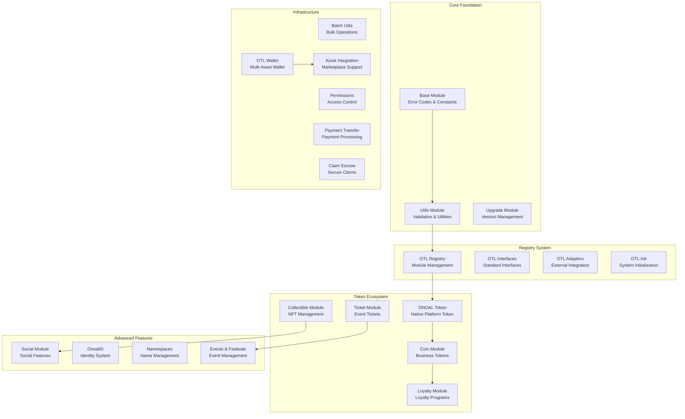

# 🪙 Onoal Token Library (OTL)

**A comprehensive, modular Move-based token ecosystem for the Sui blockchain**

[](https://opensource.org/licenses/MIT)
[](https://sui.io/)
[](https://github.com/onoal/Onoal-Token-Library)

## 🌟 Overview

The Onoal Token Library (OTL) is a complete ecosystem for creating and managing various token types on the Sui blockchain. From utility tokens and NFTs to event tickets and loyalty programs, OTL provides a robust, gas-optimized foundation for blockchain applications.

### ✨ Key Features

- **🏗️ Modular Architecture** - 23 specialized modules for different use cases
- **⚡ Gas Optimized** - Efficient batch operations and smart contract design
- **🔒 Enterprise Security** - Comprehensive permission systems and validation
- **🎯 Business Ready** - Complete solutions for real-world applications
- **📱 Mobile Integration** - QR codes, wallets, and mobile-first design
- **🌐 Ecosystem Integration** - Seamless interoperability between modules

## 🏛️ Architecture



## 📚 Module Documentation

### 🏗️ Core Foundation

| Module                                 | Description                              | Documentation                           |
| -------------------------------------- | ---------------------------------------- | --------------------------------------- |
| **[Base](docs/modules/base.md)**       | Error codes, constants, and shared types | [📖 View Docs](docs/modules/base.md)    |
| **[Utils](docs/modules/utils.md)**     | Validation functions and utilities       | [📖 View Docs](docs/modules/utils.md)   |
| **[Upgrade](docs/modules/upgrade.md)** | Version management and upgrades          | [📖 View Docs](docs/modules/upgrade.md) |

### 🗂️ Registry System

| Module                                               | Description                            | Documentation                                  |
| ---------------------------------------------------- | -------------------------------------- | ---------------------------------------------- |
| **[OTL Registry](docs/modules/otl_registry.md)**     | Central module registry and management | [📖 View Docs](docs/modules/otl_registry.md)   |
| **[OTL Interfaces](docs/modules/otl_interfaces.md)** | Standard interfaces and compliance     | [📖 View Docs](docs/modules/otl_interfaces.md) |
| **[OTL Adapters](docs/modules/otl_adapters.md)**     | External system integration            | [📖 View Docs](docs/modules/otl_adapters.md)   |
| **[OTL Init](docs/modules/otl_init.md)**             | System initialization and setup        | [📖 View Docs](docs/modules/otl_init.md)       |

### 🪙 Token Ecosystem

| Module                                         | Description                                  | Documentation                               |
| ---------------------------------------------- | -------------------------------------------- | ------------------------------------------- |
| **[ONOAL Token](docs/modules/onoal_token.md)** | Native platform token with advanced features | [📖 View Docs](docs/modules/onoal_token.md) |
| **[Coin Module](docs/modules/coin.md)**        | Business token creation and management       | [📖 View Docs](docs/modules/coin.md)        |
| **[Collectible](docs/modules/collectible.md)** | NFT creation and marketplace integration     | [📖 View Docs](docs/modules/collectible.md) |
| **[Loyalty](docs/modules/loyalty.md)**         | Comprehensive loyalty program system         | [📖 View Docs](docs/modules/loyalty.md)     |
| **[Ticket](docs/modules/ticket.md)**           | Event ticketing and access control           | [📖 View Docs](docs/modules/ticket.md)      |

### 🏗️ Infrastructure

| Module                                                     | Description                      | Documentation                                     |
| ---------------------------------------------------------- | -------------------------------- | ------------------------------------------------- |
| **[Batch Utils](docs/modules/batch_utils.md)**             | Gas-optimized bulk operations    | [📖 View Docs](docs/modules/batch_utils.md)       |
| **[Permissions](docs/modules/permissions.md)**             | Role-based access control system | [📖 View Docs](docs/modules/permissions.md)       |
| **[Payment Transfer](docs/modules/payment_transfer.md)**   | Secure payment processing        | [📖 View Docs](docs/modules/payment_transfer.md)  |
| **[Claim Escrow](docs/modules/claim_escrow.md)**           | Secure asset claiming system     | [📖 View Docs](docs/modules/claim_escrow.md)      |
| **[OTL Wallet](docs/modules/otl_wallet.md)**               | Multi-asset wallet management    | [📖 View Docs](docs/modules/otl_wallet.md)        |
| **[Kiosk Integration](docs/modules/kiosk_integration.md)** | Sui Kiosk marketplace support    | [📖 View Docs](docs/modules/kiosk_integration.md) |

### 🚀 Advanced Features

| Module                                                     | Description                                 | Documentation                                    |
| ---------------------------------------------------------- | ------------------------------------------- | ------------------------------------------------ |
| **[Social](docs/modules/social.md)**                       | Social profiles, showcases, and communities | [📖 View Docs](docs/modules/social.md)           |
| **[OnoalID](docs/modules/onoal_id.md)**                    | Decentralized identity system               | [📖 View Docs](docs/modules/onoal_id.md)         |
| **[Namespaces](docs/modules/namespaces.md)**               | Decentralized name management               | [📖 View Docs](docs/modules/namespaces.md)       |
| **[Events & Festivals](docs/modules/events_festivals.md)** | Event management and custom tokens          | [📖 View Docs](docs/modules/events_festivals.md) |

## 🚀 Quick Start

### Installation

```bash
# Clone the repository
git clone https://github.com/onoal/Onoal-Token-Library.git
cd Onoal-Token-Library

# Install Sui CLI (if not already installed)
curl -fLJO https://github.com/MystenLabs/sui/releases/latest/download/sui-macos-x86_64.tgz
tar -xf sui-macos-x86_64.tgz
sudo mv sui /usr/local/bin

# Build the project
sui move build
```

### Basic Usage

```move
// Create a business token
use otl::coin;

public entry fun create_my_business_token(ctx: &mut TxContext) {
    let registry = coin::create_utility_token_registry(
        b"My Business Tokens",
        ctx
    );

    let token_type = coin::create_token_type_with_metadata(
        &mut registry,
        MY_TOKEN {},
        b"My Business Token",
        b"MBT",
        b"Loyalty token for my business",
        b"https://mybusiness.com/logo.png",
        b"https://mybusiness.com",
        1000, // 0.001 SUI per token
        1000000, // 1M max supply
        9, // 9 decimals
        true, false, true, // transferable, not burnable, price adjustable
        100, 10, // 100+ tokens for 10% discount
        ctx
    );

    transfer::share_object(registry);
    transfer::share_object(token_type);
}
```

## 🎯 Use Cases

### 🏪 Business Applications

- **Loyalty Programs** - Points, tiers, and rewards
- **Gift Cards** - Digital gift card systems
- **Membership Tokens** - VIP access and benefits
- **Utility Tokens** - Internal business currencies

### 🎨 Creative Industries

- **NFT Collections** - Art, music, and digital collectibles
- **Creator Tokens** - Fan engagement and monetization
- **Event Tickets** - Concerts, conferences, and festivals
- **Digital Certificates** - Achievements and credentials

### 🏛️ Organizations

- **DAO Tokens** - Governance and voting rights
- **Community Rewards** - Contribution recognition
- **Access Tokens** - Exclusive content and services
- **Reputation Systems** - Trust and credibility tracking

## 🔧 Development

### Prerequisites

- **Sui CLI** - Latest version
- **Move Language** - Understanding of Move syntax
- **Rust** - For building and testing

### Project Structure

```
Onoal-Token-Library/
├── sources/                 # Move source files
│   ├── base.move           # Core foundation
│   ├── onoal_token.move    # Native token
│   ├── coin.move           # Business tokens
│   ├── collectible.move    # NFT system
│   ├── loyalty.move        # Loyalty programs
│   ├── social.move         # Social features
│   └── ...                 # Other modules
├── docs/                   # Documentation
│   ├── modules/            # Module documentation
│   ├── guides/             # Development guides
│   ├── api/                # API reference
│   └── examples/           # Code examples
├── tests/                  # Test files
├── Move.toml              # Project configuration
└── README.md              # This file
```

### Testing

```bash
# Run all tests
sui move test

# Run specific test
sui move test test_onoal_token

# Run with coverage
sui move test --coverage
```

## 📊 Statistics

- **23 Modules** - Comprehensive functionality
- **1B ONOAL Tokens** - Maximum supply
- **8 Feature Flags** - Modular capabilities
- **5 Minter Categories** - Flexible token distribution
- **Gas Optimized** - Efficient batch operations

## 🤝 Contributing

We welcome contributions! Please see our [Contributing Guide](CONTRIBUTING.md) for details.

### Development Workflow

1. **Fork** the repository
2. **Create** a feature branch
3. **Make** your changes
4. **Add** tests for new functionality
5. **Submit** a pull request

### Code Standards

- Follow Move best practices
- Include comprehensive tests
- Document all public functions
- Use consistent naming conventions

## 📄 License

This project is licensed under the MIT License - see the [LICENSE](LICENSE) file for details.

## 🔗 Links

- **Documentation**: [docs/README.md](docs/README.md)
- **API Reference**: [docs/api/README.md](docs/api/README.md)
- **Getting Started**: [docs/guides/getting-started.md](docs/guides/getting-started.md)
- **Examples**: [docs/examples/README.md](docs/examples/README.md)

## 🆘 Support

- **Issues**: [GitHub Issues](https://github.com/onoal/Onoal-Token-Library/issues)
- **Discussions**: [GitHub Discussions](https://github.com/onoal/Onoal-Token-Library/discussions)
- **Discord**: [Join our Discord](https://discord.gg/onoal)
- **Email**: support@onoal.com

## 🙏 Acknowledgments

- **Sui Foundation** - For the amazing Sui blockchain
- **Move Language Team** - For the secure Move language
- **Community Contributors** - For feedback and contributions

---

**Built with ❤️ for the Sui ecosystem**
