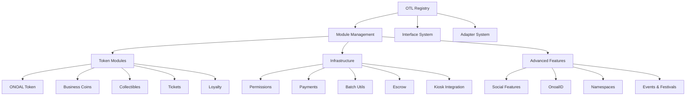

# 📚 Onoal Token Library (OTL) Documentation

Welcome to the comprehensive documentation for the **Onoal Token Library** - a modular, scalable Move-based package built for the Sui blockchain.

## 🌟 Overview

The Onoal Token Library (OTL) is a complete ecosystem for creating and managing various token types including utility tokens, NFTs, event tickets, and loyalty programs. Built with modularity and extensibility at its core, OTL provides a robust foundation for blockchain applications.

## 🏗️ Architecture



## 📖 Documentation Structure

### 🔧 Core Modules

- **[Base Module](./modules/base.md)** - Foundation with error codes, versioning, and feature flags
- **[Utils Module](./modules/utils.md)** - Shared utilities and validation functions
- **[Upgrade Module](./modules/upgrade.md)** - Package upgrade management

### 🏛️ Registry System

- **[OTL Registry](./modules/otl_registry.md)** - Central module registration and management
- **[OTL Interfaces](./modules/otl_interfaces.md)** - Standard interfaces and compliance
- **[OTL Adapters](./modules/otl_adapters.md)** - Backward compatibility system
- **[OTL Init](./modules/otl_init.md)** - System initialization

### 🪙 Token Ecosystem

- **[ONOAL Token](./modules/onoal_token.md)** - Native platform token
- **[Coin Module](./modules/coin.md)** - Business token creation utility
- **[Collectibles](./modules/collectible.md)** - NFT system with batch operations
- **[Loyalty](./modules/loyalty.md)** - Loyalty programs and point management
- **[Tickets](./modules/ticket.md)** - Event tickets and access control

### 🔧 Infrastructure

- **[Batch Utils](./modules/batch_utils.md)** - Gas-optimized batch operations
- **[Permissions](./modules/permissions.md)** - Role-based access control
- **[Payment Transfer](./modules/payment_transfer.md)** - Payment processing and airdrops
- **[Claim Escrow](./modules/claim_escrow.md)** - Fiat-to-crypto escrow system
- **[OTL Wallet](./modules/otl_wallet.md)** - Multi-asset wallet management
- **[Kiosk Integration](./modules/kiosk_integration.md)** - Sui Kiosk marketplace integration

### 🚀 Advanced Features

- **[Social](./modules/social.md)** - Social profiles and community features
- **[OnoalID](./modules/onoal_id.md)** - Identity system with verification
- **[Namespaces](./modules/namespaces.md)** - Domain-based naming system
- **[Events & Festivals](./modules/events_festivals.md)** - Event management with custom coins

## 🚀 Quick Start

### 1. Installation

```bash
# Clone the repository
git clone https://github.com/onoal/Onoal-Token-Library.git
cd Onoal-Token-Library

# Build the project
sui move build
```

### 2. Initialize the System

```move
// Initialize the complete OTL system
otl::otl_init::initialize_complete_otl_system(ctx);
```

### 3. Create Your First Token

```move
// Create a business token
let token_type = otl::coin::create_token_type(
    registry,
    b"My Token",
    b"MTK",
    b"A sample business token",
    1000, // price per token in MIST
    1000000, // max supply
    9, // decimals
    // ... other parameters
    ctx
);
```

## 🎯 Key Features

### ✨ Modular Architecture

- **Dynamic Module Loading** - Register and discover modules at runtime
- **Interface Compliance** - Standardized interfaces for interoperability
- **Backward Compatibility** - Seamless upgrades with adapter system

### 🔥 Performance Optimized

- **Gas-Efficient Batch Operations** - Process thousands of operations efficiently
- **Ultra-Lightweight Structures** - Minimized storage costs
- **Optimized Event Emission** - Compressed events for large operations

### 🛡️ Enterprise Ready

- **Comprehensive Permission System** - Role-based access control
- **Multi-Signature Support** - Enhanced security for critical operations
- **Audit Trail** - Complete transaction history and verification

### 🌐 Ecosystem Integration

- **Sui Kiosk Integration** - Native marketplace support
- **Cross-Module Communication** - Event-driven architecture
- **Extensible Plugin System** - Easy third-party integrations

## 📋 Module Categories

| Category              | Modules                                                                                             | Description                   |
| --------------------- | --------------------------------------------------------------------------------------------------- | ----------------------------- |
| **Core Foundation**   | `base`, `utils`, `upgrade`                                                                          | Essential building blocks     |
| **Registry System**   | `otl_registry`, `otl_interfaces`, `otl_adapters`, `otl_init`                                        | Module management             |
| **Token Ecosystem**   | `onoal_token`, `coin`, `collectible`, `loyalty`, `ticket`                                           | Token creation and management |
| **Infrastructure**    | `batch_utils`, `permissions`, `payment_transfer`, `claim_escrow`, `otl_wallet`, `kiosk_integration` | Supporting services           |
| **Advanced Features** | `social`, `onoal_id`, `namespaces`, `events_festivals`                                              | Enhanced functionality        |

## 🔗 Quick Links

- **[API Reference](./api/)** - Complete function and struct documentation
- **[Developer Guides](./guides/)** - Step-by-step tutorials
- **[Code Examples](./examples/)** - Practical implementation examples
- **[Migration Guide](./guides/migration.md)** - Upgrading from previous versions

## 🤝 Contributing

We welcome contributions! Please see our [Contributing Guide](../CONTRIBUTING.md) for details.

## 📄 License

This project is licensed under the MIT License - see the [LICENSE](../LICENSE) file for details.

## 🆘 Support

- **Documentation Issues**: [GitHub Issues](https://github.com/onoal/Onoal-Token-Library/issues)
- **Community**: [Discord](https://discord.gg/onoal)
- **Email**: support@onoal.com

---

_Built with ❤️ by the Onoal Team_
